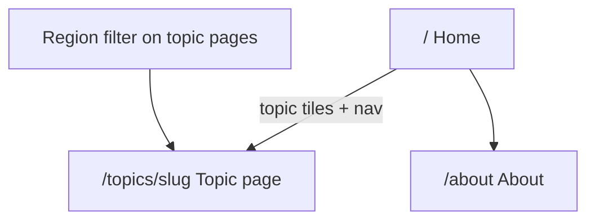

# Information Architecture

Site structure, navigation, region filter, and data-state patterns for the UK Census Data explorer.

Chart inventory lives in [topic-map.md](./topic-map.md). NOMIS details live in [nomis-research.md](./nomis-research.md).

---

## Site map

| Route            | Purpose                                                                                |
| ---------------- | -------------------------------------------------------------------------------------- |
| `/`              | Topic index: emoji tiles for the eight topics (desktop 4×2 grid, mobile single column) |
| `/topics/[slug]` | One topic: title, description, region filter, subtopic switcher, one live chart panel  |
| `/about`         | About the app, data source, and Open Government Licence                                |

No auth, no account pages, no local-authority or MSOA drill-down.

---

## Navigation

- **Brand** → Home
- **Primary nav**: eight topics from `src/lib/topics.ts`, plus **About** (desktop links + mobile sheet)
- **Region filter** on **topic pages only** (replaces the former global bar / “Showing: …” line)
- **Footer**: Census 2021 / NOMIS attribution

---

## Region filter

- **Options**: England and Wales (default), England, Wales, then English regions A–Z
- **Default**: England and Wales (`2092957703`)
- **Persistence**: URL search param `?geography=<code>` (shareable). Invalid or missing → England and Wales
- **Scope**: global — changing region updates the param and is visible on home and all topic pages
- **Display**: dropdown shows geography **names**, not NOMIS codes

---

## Topic pages

1. Title + short description
2. Region filter (URL `?geography=` source of truth)
3. Subtopic buttons when a topic has multiple charts — first chart is the default
4. One live chart panel at a time (switching buttons replaces the chart; no stacked charts)

Home is a topic index (emoji tiles; desktop 4×2 square grid, mobile single column), not a dashboard of KPIs. No region filter on home.

---

## Data states

Shared components under `src/components/data/`:

| State           | When                                    | UI                                                         |
| --------------- | --------------------------------------- | ---------------------------------------------------------- |
| **Unavailable** | Chart not available for the view        | Dashed panel: “Data unavailable” + short note (no numbers) |
| **Loading**     | Fetch in flight                         | Skeleton pulse block                                       |
| **Error**       | NOMIS fail / offline + no cache         | `role="alert"`: “Data unavailable” + detail + Retry        |
| **Stale**       | Served from cache after network failure | Subtle “Cached — may be out of date” badge on success UI   |

Topic charts use Loading / Error / Stale via `CensusChartPanel`.

---

## Non-goals

- No mock or invented statistics
- No finer geographies than region / England & Wales (see roadmap Stage 6)

---

## Chart wiring

All charts in [topic-map.md](./topic-map.md) (20 univariate charts across 8 topics) load via `/api/nomis` + `loadCensusSeries`, respect `?geography=`, plot count values with percent alongside in tooltips (`20100` + `20301`), use browser cache, and render with Recharts (`pie` / `bar` / `horizontal-bar`) plus shared Loading / Error / Stale states.

**Also in place:** CSV/JSON export and Share per chart (exports include count and percent); client fetch queue + in-flight dedupe; proxy rate limit; PWA manifest + app-shell service worker (offline = shell + last chart cache only); v2 design ([design.md](./design.md)).

**Still later:** Acceptance checks doc; cross-tabs; LA/MSOA geography (see [roadmap.md](./roadmap.md)).
