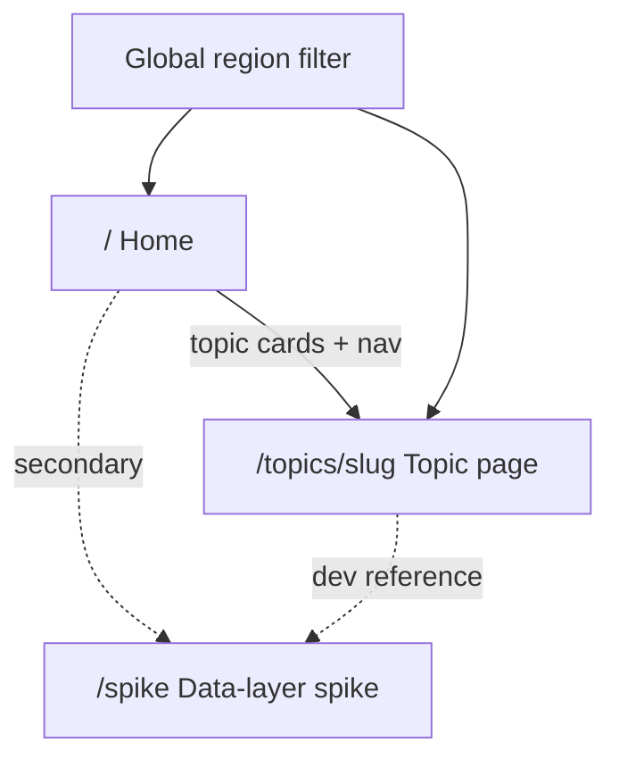

# Information Architecture (v1 shell)

Site structure, navigation, region filter, and data-state patterns for the UK Census Data explorer.

Chart inventory lives in [topic-map.md](./topic-map.md). NOMIS details live in [nomis-research.md](./nomis-research.md).

---

## Site map

| Route            | Purpose                                                                                                  |
| ---------------- | -------------------------------------------------------------------------------------------------------- |
| `/`              | Product intro, selected region label, grid of 8 topics with planned chart names                          |
| `/topics/[slug]` | One topic: breadcrumb, description, region readout, stacked chart slots (1–2 per topic)                  |
| `/spike`         | Data-layer proof (live NOMIS / cache / failure). Secondary — footer and home only, not primary topic nav |

No auth, no account pages, no local-authority or MSOA drill-down.

---

## Navigation

- **Brand** → Home
- **Primary nav**: eight topics from `src/lib/topics.ts` (desktop links + mobile sheet)
- **Global region filter** in the header (desktop: near brand / before topic links; mobile: in the sheet + compact control)
- **Footer**: Census 2021 / NOMIS attribution and a link to the data-layer spike

---

## Region filter

- **Options**: England and Wales + ten England & Wales regions (`ENGLAND_AND_WALES`, `REGIONS` in `src/lib/nomis/constants.ts`)
- **Default**: North West (`2013265922`)
- **Persistence**: URL search param `?geography=<code>` (shareable). Invalid or missing → default North West
- **Scope**: global — changing region updates the param and is visible on home and all topic pages. Charts will respect it when wired.

---

## Topic pages

1. Breadcrumb: Home / Topic name
2. Title + short description
3. “Showing: {region name}” (header region control is the source of truth)
4. Chart slots — one panel per v1 chart from the topic map: title, table code, chart-type hint, body = **Data unavailable** until wired (never invented numbers)
5. In-page anchors when a topic has two charts

Home is a topic index, not a dashboard of KPIs.

---

## Data states

Shared components under `src/components/data/`:

| State           | When                                    | UI                                                         |
| --------------- | --------------------------------------- | ---------------------------------------------------------- |
| **Unavailable** | Chart not connected yet                 | Dashed panel: “Data unavailable” + short note (no numbers) |
| **Loading**     | Fetch in flight                         | Skeleton pulse block                                       |
| **Error**       | NOMIS fail / offline + no cache         | `role="alert"` + Retry; copy that data cannot be fetched   |
| **Stale**       | Served from cache after network failure | Subtle “Cached / may be stale” badge on success UI         |

Topic chart slots use **Unavailable** until a vertical slice wires them. Loading / Error / Stale are used on `/spike` and ready for wired charts.

---

## Non-goals (this stage)

- No mock or invented statistics
- No finer geographies than region / England & Wales
- Spike is not primary navigation
- Charts are not yet wired to NOMIS on topic pages

---

## Next stage (proposed)

**Vertical slice:** wire Demographics → Sex (`NM_2028_1` / TS008) for the selected `?geography=` region end-to-end:

1. Topic page chart slot fetches via existing `/api/nomis` + `loadCensusSeries` (respect region param and localStorage cache)
2. Render with Recharts (pie), using shared Loading / Error / Stale states
3. No mock data; export CSV/JSON can follow in a polish pass

Then roll the same pattern across the remaining v1 charts.
