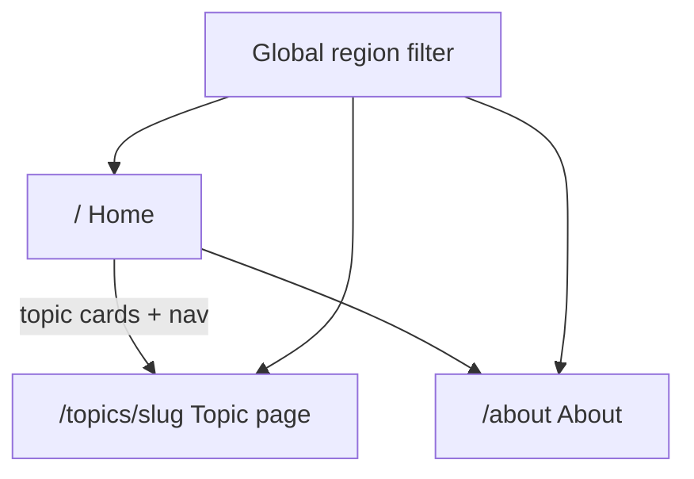

# Information Architecture (v1 shell)

Site structure, navigation, region filter, and data-state patterns for the UK Census Data explorer.

Chart inventory lives in [topic-map.md](./topic-map.md). NOMIS details live in [nomis-research.md](./nomis-research.md).

---

## Site map

| Route            | Purpose                                                                                 |
| ---------------- | --------------------------------------------------------------------------------------- |
| `/`              | Product intro, selected region label, grid of 8 topics with planned chart names         |
| `/topics/[slug]` | One topic: breadcrumb, description, region readout, stacked chart slots (1–2 per topic) |
| `/about`         | About the app, data source, and Open Government Licence                                 |

No auth, no account pages, no local-authority or MSOA drill-down.

---

## Navigation

- **Brand** → Home
- **Primary nav**: eight topics from `src/lib/topics.ts`, plus **About** (desktop links + mobile sheet)
- **Region filter** on **topic pages only** (replaces the former global bar / “Showing: …” line)
- **Footer**: Census 2021 / NOMIS attribution

---

## Region filter

- **Options**: England and Wales (default), England, Wales, then English regions A–Z
- **Default**: England and Wales (`2092957703`)
- **Persistence**: URL search param `?geography=<code>` (shareable). Invalid or missing → England and Wales
- **Scope**: global — changing region updates the param and is visible on home and all topic pages
- **Display**: dropdown shows geography **names**, not NOMIS codes

---

## Topic pages

1. Breadcrumb: Home / Topic name
2. Title + short description
3. Region filter (URL `?geography=` source of truth)
4. Subtopic buttons when a topic has multiple charts — first chart is the default
5. One live chart panel at a time (switching buttons replaces the chart; no stacked charts)

Home is a topic index (emoji tiles; desktop 4×2 square grid, mobile single column), not a dashboard of KPIs. No region filter on home.

---

## Data states

Shared components under `src/components/data/`:

| State           | When                                    | UI                                                         |
| --------------- | --------------------------------------- | ---------------------------------------------------------- |
| **Unavailable** | Chart not connected yet                 | Dashed panel: “Data unavailable” + short note (no numbers) |
| **Loading**     | Fetch in flight                         | Skeleton pulse block                                       |
| **Error**       | NOMIS fail / offline + no cache         | `role="alert"` + Retry; copy that data cannot be fetched   |
| **Stale**       | Served from cache after network failure | Subtle “Cached / may be stale” badge on success UI         |

Topic charts use Loading / Error / Stale via `CensusChartPanel`.

---

## Non-goals (shell / v1 charts)

- No mock or invented statistics
- No finer geographies than region / England & Wales

---

## Chart wiring (v1)

All 11 v1 charts (see [topic-map.md](./topic-map.md)) load via `/api/nomis` + `loadCensusSeries`, respect `?geography=`, use browser cache, and render with Recharts (`pie` / `bar` / `horizontal-bar`) plus shared Loading / Error / Stale states.

**Also in place:** CSV/JSON export per chart; client fetch queue + in-flight dedupe; proxy rate limit; PWA manifest + app-shell service worker (offline = shell + last chart cache only).

**Still later:** Share-on-mobile, acceptance checks doc. Branding polish delivered in v2 ([design.md](./design.md)).
