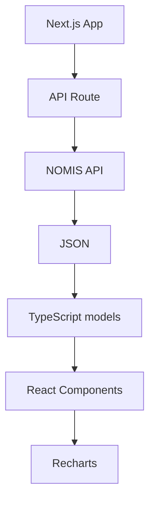

# UK CENSUS DATA Requirements

A modern web application for exploring and visualizing UK Census 2021 data with interactive charts, filters, and geographic area selection.

Complete UK Census 2021 Data Visualization Platform

Major UK Census 2021 topic areas must be integrated with real NOMIS API data, providing access to official UK government statistics through an intuitive, responsive web interface.

This document is a living product brief. It is **not** intended as a single prompt to build the entire application. Development should proceed in stages (scaffolding, NOMIS research, topic/subtopic mapping, UI/IA, charts, polish), with AI assistance used to research unknowns and propose details for human review before implementation.


# Architecture


## Frontend-Only Architecture

Use a frontend-only architecture with the following benefits:

- Simple Deployment: No dedicated backend infrastructure required
- Cost Effective: No server costs or maintenance beyond hosting
- Fast Development: Direct API integration with data source
- Scalable: Easy to add a fuller backend later if needed

Note: Next.js API routes may be used as a thin proxy to the NOMIS API (e.g. to avoid CORS limits). This is allowed and does not count as a separate backend system.


## Technology Stack

The application must use this stack:

| Technology   | Role                                   | Category      |
| ------------ | -------------------------------------- | ------------- |
| Next.js      | Application framework                  | Architecture  |
| React        | Build UI components                    | Front end     |
| TypeScript   | Type safety                            | Language      |
| Tailwind CSS | Styling                                | CSS           |
| shadcn/ui    | Ready-made UI components               | UI library    |
| Lucide React | Icons                                  | Assets/UI     |
| Recharts     | Data visualisation                     | Charts        |
| ESLint       | Detect code issues                     | Quality       |
| Prettier     | Format code                            | Quality       |
| Husky        | Run checks before commits              | Git workflow  |
| lint-staged  | Run checks only on changed files       | Performance   |
| Vercel       | Build and host the application         | Deployment    |


## Design Principles

These are important!

- HTTP Client: Native fetch API
- Caching: Browser localStorage/sessionStorage
- UI Components: Custom skeleton loading and error handling
- Animations: CSS transitions and micro-interactions
- Centralized Configuration: Constants and utilities for maintainability
- Modular Components: Smaller, reusable components for better maintainability
- No Mock Data: All data sourced from the NOMIS API on page load
- Design: Start with a clean, generic modern UI using the stack above; refine branding and visual identity later


## Data Flow




# Data Integration

Data **must** be drawn from the NOMIS API on page load (or from a valid browser cache of a previous successful fetch). **Never** mock or invent data.

## NOMIS Call Pattern

```
const url = `${NOMIS_BASE_URL}/dataset/${datasetId}.jsonstat.json?date=latest&geography=${geography}&c2021_category=0...N&measures=${measures}`
```

Parameters, such as `datasetId` and `geography`, are often codes (e.g. `geography=2092957703` is the code for England and Wales). These need to be discovered (via NOMIS research) and stored in a dictionary or similar.

NOMIS base URL, rate limits, dataset IDs, category codes, and geography codes are **to be researched as a dedicated development step** and documented before topic pages are built out in full.

## No Mock Data

There must be **no mock data in the system**. This is extremely important and must always be followed.

- If NOMIS is unreachable and a valid last-fetched cache exists, use that cache and indicate the data may be stale.
- If NOMIS is unreachable and no valid cache is available, the visualization must state that data cannot be fetched. Do **not** invent, fabricate, or use placeholder “test” figures.


# Topic Areas

The following major topic areas are in scope. Example subtopics in parentheses are illustrative only; the full subtopic list and matching NOMIS datasets/chart types are **to be identified with AI assistance** during research and mapping stages.

| Topic | Example subtopics (incomplete) |
| ----- | ------------------------------ |
| Demographics | age, gender, *(to be defined)*  |
| Housing | types, occupation, *(to be defined)*  |
| Employment | *(to be defined)* |
| Education | *(to be defined)* |
| Health and Disability | *(to be defined)* |
| Transport | *(to be defined)* |
| Family and Relationships | *(to be defined)* |
| Migration | *(to be defined)* |

Subtopics should be grouped sensibly under these topics, with filters where useful.


# Geography

- Primary filter level: **UK regions** (e.g. North West, North East, and other standard England and Wales / UK regional geographies as supported by NOMIS Census 2021).
- Default geography and exact NOMIS geography codes are to be confirmed during NOMIS research.
- Finer geographies (e.g. local authority) are out of scope unless added later.


# Information Architecture and Acceptance Criteria

Not fully defined yet. These should be co-developed with AI in later stages:

- Site structure, navigation, and page layout
- Subtopics per major topic and preferred chart types (bar, pie, etc.)
- Concrete acceptance checks per topic/chart (e.g. “Demographics → Age for North West loads from NOMIS and exports CSV”)

Until those exist, implement only what the current stage asks for; do not invent a full product IA unprompted.


# Functional Requirements

- Topic Coverage: Implement the major topic areas listed above (subtopics researched and agreed per stage).
- Filters: Regional geography filters; subtopic filters where useful.
- Interactive Charts for each data source.
- Live Data: Integration with UK NOMIS API (plus last-successful browser cache when offline/unavailable).
- Responsive Design: Works on desktop, tablet, and mobile.
- Smart Caching: Browser-based caching for performance and limited offline use.
- Rate Limiting: Built-in protection against API limits.
- Responsive Chart Orientation: Automatic chart layout adaptation for mobile devices.
- Professional UI/UX: Skeleton loading, smooth animations, and enhanced error handling (generic first; refine later).
- Modern Animations: Micro-interactions and smooth transitions throughout.
- Smart Error Recovery: Context-aware error messages with retry functionality.
- PWA Support: Add to home screen; offline uses last cached data only (see No Mock Data).
- Universal Data Export: Export functionality on all chart components (CSV, JSON, and Share on mobile).
- Smart Label Formatting: Clean, readable category names in exports and charts.
- Graceful Error Handling: No error popups for user cancellations.


# Device Compatibility

## Mobile Experience

- Perfect Fit: Charts fit within mobile screen width
- Readable Labels: Text wraps properly on small screens
- Touch-Friendly: Easy to tap and interact
- No Horizontal Scrolling: No horizontal overflow issues
- Smooth Transitions: Responsive to orientation changes
- Orientation: Responsive to device rotation

## Desktop Experience

- Full Layout: Utilizing horizontal screen estate
- Rich Interactions: Hover effects and detailed tooltips
- Professional Appearance: Clean, modern data visualization

## Devices

- iPhone Safari
- Android Chrome
- Desktop Chrome


## Not Required

The following are **NOT** envisaged as current or future requirements:
- User authentication
- Separate backend system (beyond Next.js API routes used as a NOMIS proxy)
- Permanent server-side data store (browser cache of last successful fetch is allowed)
