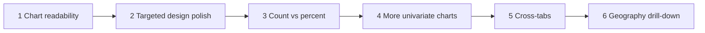

# Roadmap (post-v3)

Staged next work for the UK Census Data app after v3 charts and the v2 design pass.

**Baseline (done):** 20 univariate charts across 8 topics (`docs/topic-map.md`), calm institutional UI (`docs/design.md`), export/share, PWA, Vitest + CI.

**Still deferred in topic-map:** cross-tabs, local authority / MSOA geography.

Use one agent chat (or PR) per stage. Prefer **plan → human approve → implement** when product behaviour changes.



---

## Stage 1 — Chart readability

**Goal:** Every existing chart is readable at ~375px and ~1280px; no overlapping or truncated-to-useless labels.

**Scope:** Presentation only. No new datasets, routes, or IA changes.

| Work                  | Notes                                                                                                  |
| --------------------- | ------------------------------------------------------------------------------------------------------ |
| Audit worst offenders | Age bands, ethnic group, industry, household composition, travel method, and any other dense bars/pies |
| Vertical bars         | Prefer horizontal earlier on narrow viewports; truncate + tooltip; avoid crushed angled ticks          |
| Horizontal bars       | Tune Y-axis width / label length; keep dynamic height; full label in tooltip                           |
| Pies                  | Legend wrap/height; no clipping                                                                        |
| Shared label helper   | Short display names on axes; full NOMIS label in tooltip and exports                                   |

**Out of scope:** New charts, redesign, percent toggle.

**Human gate:** Phone + desktop check on the densest charts.

**Prompt:** see [Stage 1 agent prompt](#stage-1-agent-prompt) below (also the copy-paste block in chat / `prompt-record.md`).

---

## Stage 2 — Targeted design polish

Not a second full redesign. After Stage 1 QA, approve a short bullet list (3–5 items), for example:

- Home topic tiles / emoji density
- Chart panel chrome vs export/share clutter
- Region filter + subtopic switcher spacing on mobile
- Empty / error / stale copy consistency
- Doc sync (e.g. stale wording in `nomis-research.md`)

**Agent rule:** Apply only the approved list; preserve tokens and mood from `design.md`.

**Prompt:** see [Stage 2 agent prompt](#stage-2-agent-prompt) below.

---

## Stage 3 — Percent measure (`20301`)

**Status:** shipped (panel Count / Percent toggle; no URL persistence).

| Step     | Deliverable                                                 |
| -------- | ----------------------------------------------------------- |
| Research | Confirm percent works on wired datasets                     |
| Product  | Count / Percent control on the chart panel (or topic-level) |
| Data     | `measures` param; cache key includes measure                |
| UI       | Axis/tooltip `%` formatting; exports include measure        |
| Tests    | Client, panel, proxy query shaping                          |

**Human gate:** Approve toggle UX before coding.

**Prompt:** see [Stage 3 agent prompt](#stage-3-agent-prompt) below.

---

## Stage 4 — More univariate subtopics (optional)

Only after Stages 1–2 (ideally after 3).

1. Research remaining Census Topic Summaries → propose **≤8** candidates that fit current topics.
2. Human trims/rejects in `topic-map.md`.
3. Wire approved rows only (constants → topic-map → panels), same pattern as v3.
4. Live NOMIS check + tests + one mobile check each.

**Prompt:** see [Stage 4 agent prompt](#stage-4-agent-prompt) below.

---

## Stage 5 — Cross-tabs

Needs a second-dimension chart pattern (heatmap, grouped bars, or facets).

1. Spike one table (e.g. TS009 sex by age).
2. Agree chart type + IA for mobile.
3. Roll out at most 1–2 cross-tabs until the pattern is solid.

**Prompt:** see [Stage 5 agent prompt](#stage-5-agent-prompt) below.

---

## Stage 6 — Finer geography (LA / MSOA)

Explicitly out of scope in `ia.md` today. Requires product decision, then geography discovery, cascading filter, URL/cache changes, and rate/cell-limit care (guest ~25k cells).

**Prompt:** see [Stage 6 agent prompt](#stage-6-agent-prompt) below.

---

## Cross-cutting (slot in as needed)

| Area                                                 | When                                   |
| ---------------------------------------------------- | -------------------------------------- |
| Per-chart acceptance checks doc                      | After Stage 1 or with Stage 4          |
| Accessibility (focus, chart summary, reduced motion) | Small pass after Stage 2               |
| Compare regions                                      | After percent; before or instead of LA |
| Prefetch / cache UX                                  | Opportunistic with Stage 3             |

**Out of product scope unless reopened:** auth, separate backend DB, Scotland/NI Census, dark mode.

---

## Agent cadence

1. New chat per stage.
2. Do not combine unrelated goals (e.g. “fix labels + add five datasets + redesign home”).
3. No mock data; update `topic-map.md` / constants when adding charts; run `npm run test:run`.
4. Prefer concrete prompts (“fix overlapping labels for the existing 20 charts”) over open-ended “improve the design”.

### Priority if only three stages ship

1. Chart readability
2. Count ↔ percent
3. Either Stage 2 design fix-up **or** a small approved univariate batch — not both in one run

---

## Stage 1 agent prompt

Copy into a **new** agent chat when ready to implement:

```text
Implement Stage 1 from docs/roadmap.md: chart readability for the existing 20 Census charts.

Context:
- Charts render in src/components/charts/census-chart-view.tsx (pie / bar / horizontal-bar).
- Inventory is docs/topic-map.md and src/lib/topic-map.ts.
- Design tokens and chart colours stay as in docs/design.md — this is presentation polish only.

Goals:
- Make every existing chart readable at ~375px and ~1280px widths.
- Fix overlapping, crushed, or truncated-to-useless axis/legend labels.
- Prefer horizontal-bar (or equivalent) on narrow viewports where vertical angled ticks fail.
- Truncate long category labels on axes; show the full NOMIS label in the tooltip (and keep exports using clear labels).
- Fix pie legend overflow/clipping where needed.
- Add or extend a small shared label-formatting helper if that keeps the chart component clean.

Constraints:
- No new datasets, topics, routes, or IA changes.
- No mock/invented data.
- No full visual redesign — only chart label/layout readability.
- Keep existing unit tests passing; add/adjust tests for any new label helpers.

Process:
1. Briefly list the worst offenders you will fix (from code + fixtures if useful).
2. Implement the fixes.
3. Run npm run test:run.
4. Summarise what changed, which charts remain imperfect, and any follow-ups for Stage 2.

Do not start Stages 2–6.
```

---

## Stage 2 agent prompt

Copy into a **new** agent chat when Stage 1 is done and you are ready for design polish:

```text
Implement Stage 2 from docs/roadmap.md: targeted design polish (not a second full redesign).

Context:
- Visual system is locked in docs/design.md (calm institutional, light only, Source Serif 4 + Source Sans 3, cool neutrals + deep teal).
- IA and routes stay as in docs/ia.md — do not add pages or change navigation structure.
- Chart inventory stays as in docs/topic-map.md — no new datasets in this stage.
- Surfaces live mainly under src/app/, src/components/layout/, src/components/data/, and globals.css / app/layout.tsx.

Goals:
- After a short human-approved bullet list (3–5 items), apply only those fixes.
- Example candidates (propose from a real pass of the UI; do not invent a redesign):
  - Home topic tiles / emoji density
  - Chart panel chrome vs export/share clutter
  - Region filter + subtopic switcher spacing on mobile
  - Empty / error / stale copy consistency
  - Doc sync (e.g. stale wording in docs/nomis-research.md or similar)
- Preserve existing design tokens, mood, and chart colours from docs/design.md.

Constraints:
- No new datasets, topics, routes, or chart types.
- No mock/invented data.
- No full visual redesign or dark mode.
- Do not reopen Stage 1 chart-label work unless a polish item explicitly requires a tiny follow-up.
- Keep existing unit tests passing; add/adjust tests only if UI behaviour copy or components change in a testable way.

Process:
1. Inspect the live surfaces (home, one dense topic page, empty/error/stale states, docs that look stale) and propose a concrete 3–5 item bullet list.
2. STOP and wait for human approval / edits to that list. Do not implement before approval.
3. Implement only the approved items.
4. Run npm run test:run.
5. Summarise what changed, what was deferred, and any follow-ups for Stage 3.

Do not start Stages 3–6.
```

---

## Stage 3 agent prompt

Copy into a **new** agent chat when ready to add count vs percent (after Stages 1–2, or after Stage 1 if prioritizing the three-stage cut):

```text
Implement Stage 3 from docs/roadmap.md: Count vs Percent measure (`20301`).

Context:
- NOMIS measures already exist in src/lib/nomis/constants.ts as NOMIS_MEASURES.value (`20100`) and NOMIS_MEASURES.percent (`20301`).
- Fetch path: /api/nomis → src/lib/nomis/client.ts (loadCensusSeries) → cache in src/lib/nomis/cache.ts (cache key already includes measures).
- Charts load via src/components/data/census-chart-panel.tsx and render in src/components/charts/census-chart-view.tsx.
- Inventory: docs/topic-map.md and src/lib/topic-map.ts.
- Exports: src/lib/export/download.ts and chart export actions.

Goals:
- Let the user switch between Count (20100) and Percent (20301) for the wired univariate charts.
- Research first: confirm percent works on the currently wired datasets (spot-check live NOMIS responses; note any tables that fail).
- Product: Count / Percent control on the chart panel (or topic-level if that is clearly better — propose one).
- Data: pass measures through client, proxy query shaping, and cache keys correctly.
- UI: format axes/tooltips with `%` when percent is selected; keep count formatting for 20100.
- Exports (CSV/JSON) include which measure was used and the correct values.
- Tests covering client, panel, and proxy query shaping for measures.

Constraints:
- No new datasets, topics, or geography levels.
- No mock/invented data — use live NOMIS (or existing fixtures only where tests already do).
- No full redesign; reuse existing panel chrome and design tokens.
- Guest cell limits and rate-limit behaviour still apply.
- Prefer plan → human approve → implement for the toggle UX.

Process:
1. Research: confirm percent on wired datasets; list any that do not support 20301.
2. Propose Count / Percent UX (placement, default, URL persistence or not) in a short brief.
3. Implement measures wiring, formatting, exports, and tests.
4. Run npm run test:run.
5. Commit the update with message "feat(data): xxx"
6. Summarise behaviour, any datasets that stay count-only, and follow-ups for Stage 4+.

Do not start Stages 4–6.
```

---

## Stage 4 agent prompt

Copy into a **new** agent chat when ready to add more univariate charts (after Stages 1–2; ideally after Stage 3):

```text
Implement Stage 4 from docs/roadmap.md: more univariate subtopics (optional expansion).

Context:
- Current inventory and deferred list: docs/topic-map.md and src/lib/topic-map.ts.
- Wiring pattern from v3: NOMIS dataset constants → topic-map rows → topic chart panels / slots.
- Key files: src/lib/nomis/constants.ts (or chart/dataset maps), src/lib/topic-map.ts, src/components/data/topic-charts.tsx, src/components/data/census-chart-panel.tsx.
- Chart types remain pie / bar / horizontal-bar unless a new table clearly needs the existing patterns only.
- Docs: docs/nomis-research.md for NOMIS conventions; docs/ia.md for topic-page behaviour (one chart at a time + subtopic switcher).

Goals:
1. Research remaining Census Topic Summaries and propose ≤8 univariate candidates that fit the existing 8 topics.
2. After human trim/reject in docs/topic-map.md, wire only the approved rows.
3. Same quality bar as v3: live NOMIS check, tests, readable labels, one mobile check each.
4. Update docs/topic-map.md (and related constants) so inventory stays the source of truth.

Constraints:
- No cross-tabs, no percent work (unless already shipped in Stage 3 and needed for consistency), no LA/MSOA geography.
- No mock/invented data.
- Do not invent chart types beyond the existing univariate set.
- Do not expand beyond the approved candidate list.
- Prefer plan → human approve → implement.

Process:
1. Research and propose ≤8 candidates as a table: topic, subtopic name, Census table ID, suggested chart type, brief rationale.
2. STOP and wait for human trim/reject; update docs/topic-map.md only after approval.
3. Wire approved rows only (constants → topic-map → panels), following the existing pattern.
4. Live NOMIS smoke-check each new chart; add/adjust unit tests.
5. Run npm run test:run.
6. Summarise what was added, what was rejected, and any label/readability follow-ups.

Do not start Stages 5–6.
```

---

## Stage 5 agent prompt

Copy into a **new** agent chat when ready for cross-tabs (after univariate work is stable):

```text
Implement Stage 5 from docs/roadmap.md: cross-tabs (second dimension).

Context:
- Deferred in docs/topic-map.md (e.g. TS009 sex by age).
- Current charts are univariate only: pie / bar / horizontal-bar in src/components/charts/census-chart-view.tsx.
- Data path: /api/nomis, src/lib/nomis/parse-jsonstat.ts, loadCensusSeries, census-chart-panel.
- IA: docs/ia.md — topic pages show one chart at a time with subtopic switcher; mobile must stay usable.
- Guest NOMIS cell limit ~25k (src/lib/nomis/constants.ts).

Goals:
1. Spike one cross-tab table (prefer TS009 sex by age unless research shows a better first candidate).
2. Propose a chart pattern for two dimensions: heatmap, grouped bars, or facets — pick one primary recommendation with mobile IA notes.
3. After human agreement, implement at most 1–2 cross-tabs until the pattern is solid.
4. Extend parsing / series types / chart view only as needed for the agreed pattern.
5. Tests for parse + render path; live NOMIS check; update docs/topic-map.md for approved cross-tabs.

Constraints:
- Do not roll out a large batch of cross-tabs in this stage.
- No mock/invented data.
- No LA/MSOA geography in this stage.
- Stay within guest cell limits; keep category selections tight if needed.
- Prefer plan → human approve → implement for chart type + IA.
- Preserve design tokens from docs/design.md.

Process:
1. Spike: fetch/parse one cross-tab; document dimensions, cell count, and rendering options.
2. Propose chart type + mobile IA in a short brief (include why not the alternatives).
3. STOP and wait for human agreement on chart type + which 1–2 tables to ship.
4. Implement the agreed pattern and wire at most those 1–2 cross-tabs.
5. Run npm run test:run.
6. Summarise the pattern, limitations, and what would be needed to add more cross-tabs later.

Do not start Stage 6.
```

---

## Stage 6 agent prompt

Copy into a **new** agent chat when ready for finer geography (only after product decision to reopen IA scope):

```text
Implement Stage 6 from docs/roadmap.md: finer geography (local authority / MSOA).

Context:
- Explicitly out of scope today in docs/ia.md (region-level filter only: England and Wales, England, Wales, English regions).
- Geography helpers: src/lib/nomis/constants.ts, src/lib/geography-url.ts, src/components/layout/region-filter.tsx / topic-region-filter.tsx.
- URL source of truth: `?geography=<code>`; cache keys include geography (src/lib/nomis/cache.ts).
- Guest cell limit ~25k — finer geography + wide tables can blow the limit.
- Research notes: docs/nomis-research.md.

Goals:
1. Product decision first: which levels to support (LA and/or MSOA), default behaviour, and how the cascading filter should work on mobile and desktop.
2. Discover NOMIS geography types/codes needed; document them (constants + research note).
3. Implement cascading geography filter + URL/cache updates so selections are shareable and cached correctly.
4. Guard against cell-limit / rate-limit failures with clear empty/error/stale UX (no invented data).
5. Update docs/ia.md and docs/topic-map.md deferred notes once the new scope is real.

Constraints:
- No auth, no separate backend DB, no Scotland/NI Census, no dark mode.
- No mock/invented geography lists or values — research real NOMIS codes.
- Prefer LA before MSOA if both are ambitious; do not ship an unusable deep drill-down.
- Prefer plan → human approve → implement for the product decision and filter UX.
- Keep existing region behaviour working; invalid geography still falls back safely.

Process:
1. Research NOMIS geography discovery for LA / MSOA under England and Wales; note cell-limit risks per chart.
2. Propose product decision + cascading filter UX + URL shape in a short brief.
3. STOP and wait for human approval before coding the filter.
4. Implement approved geography levels, constants, filter UI, URL/cache wiring, and tests.
5. Run npm run test:run; smoke-check a few charts at the new geography level.
6. Summarise supported levels, known cell-limit caveats, and any deferred compare-regions work.

Do not start unrelated roadmap items (compare regions, large new chart batches) unless the human explicitly expands scope.
```
