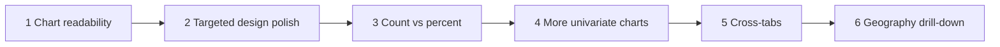

# Roadmap (post-v3)

Staged next work for the UK Census Data app after v3 charts and the v2 design pass.

**Baseline (done):** 20 univariate charts across 8 topics (`docs/topic-map.md`), calm institutional UI (`docs/design.md`), export/share, PWA, Vitest + CI.

**Still deferred in topic-map:** cross-tabs, percent measure (`20301`), local authority / MSOA geography.

Use one agent chat (or PR) per stage. Prefer **plan → human approve → implement** when product behaviour changes.



---

## Stage 1 — Chart readability

**Goal:** Every existing chart is readable at ~375px and ~1280px; no overlapping or truncated-to-useless labels.

**Scope:** Presentation only. No new datasets, routes, or IA changes.

| Work                  | Notes                                                                                                  |
| --------------------- | ------------------------------------------------------------------------------------------------------ |
| Audit worst offenders | Age bands, ethnic group, industry, household composition, travel method, and any other dense bars/pies |
| Vertical bars         | Prefer horizontal earlier on narrow viewports; truncate + tooltip; avoid crushed angled ticks          |
| Horizontal bars       | Tune Y-axis width / label length; keep dynamic height; full label in tooltip                           |
| Pies                  | Legend wrap/height; no clipping                                                                        |
| Shared label helper   | Short display names on axes; full NOMIS label in tooltip and exports                                   |

**Out of scope:** New charts, redesign, percent toggle.

**Human gate:** Phone + desktop check on the densest charts.

**Prompt:** see [Stage 1 agent prompt](#stage-1-agent-prompt) below (also the copy-paste block in chat / `prompt-record.md`).

---

## Stage 2 — Targeted design polish

Not a second full redesign. After Stage 1 QA, approve a short bullet list (3–5 items), for example:

- Home topic tiles / emoji density
- Chart panel chrome vs export/share clutter
- Region filter + subtopic switcher spacing on mobile
- Empty / error / stale copy consistency
- Doc sync (e.g. stale wording in `nomis-research.md`)

**Agent rule:** Apply only the approved list; preserve tokens and mood from `design.md`.

---

## Stage 3 — Percent measure (`20301`)

| Step     | Deliverable                                                 |
| -------- | ----------------------------------------------------------- |
| Research | Confirm percent works on wired datasets                     |
| Product  | Count / Percent control on the chart panel (or topic-level) |
| Data     | `measures` param; cache key includes measure                |
| UI       | Axis/tooltip `%` formatting; exports include measure        |
| Tests    | Client, panel, proxy query shaping                          |

**Human gate:** Approve toggle UX before coding.

---

## Stage 4 — More univariate subtopics (optional)

Only after Stages 1–2 (ideally after 3).

1. Research remaining Census Topic Summaries → propose **≤8** candidates that fit current topics.
2. Human trims/rejects in `topic-map.md`.
3. Wire approved rows only (constants → topic-map → panels), same pattern as v3.
4. Live NOMIS check + tests + one mobile check each.

---

## Stage 5 — Cross-tabs

Needs a second-dimension chart pattern (heatmap, grouped bars, or facets).

1. Spike one table (e.g. TS009 sex by age).
2. Agree chart type + IA for mobile.
3. Roll out at most 1–2 cross-tabs until the pattern is solid.

---

## Stage 6 — Finer geography (LA / MSOA)

Explicitly out of scope in `ia.md` today. Requires product decision, then geography discovery, cascading filter, URL/cache changes, and rate/cell-limit care (guest ~25k cells).

---

## Cross-cutting (slot in as needed)

| Area                                                 | When                                   |
| ---------------------------------------------------- | -------------------------------------- |
| Per-chart acceptance checks doc                      | After Stage 1 or with Stage 4          |
| Accessibility (focus, chart summary, reduced motion) | Small pass after Stage 2               |
| Compare regions                                      | After percent; before or instead of LA |
| Prefetch / cache UX                                  | Opportunistic with Stage 3             |

**Out of product scope unless reopened:** auth, separate backend DB, Scotland/NI Census, dark mode.

---

## Agent cadence

1. New chat per stage.
2. Do not combine unrelated goals (e.g. “fix labels + add five datasets + redesign home”).
3. No mock data; update `topic-map.md` / constants when adding charts; run `npm run test:run`.
4. Prefer concrete prompts (“fix overlapping labels for the existing 20 charts”) over open-ended “improve the design”.

### Priority if only three stages ship

1. Chart readability
2. Count ↔ percent
3. Either Stage 2 design fix-up **or** a small approved univariate batch — not both in one run

---

## Stage 1 agent prompt

Copy into a **new** agent chat when ready to implement:

```text
Implement Stage 1 from docs/roadmap.md: chart readability for the existing 20 Census charts.

Context:
- Charts render in src/components/charts/census-chart-view.tsx (pie / bar / horizontal-bar).
- Inventory is docs/topic-map.md and src/lib/topic-map.ts.
- Design tokens and chart colours stay as in docs/design.md — this is presentation polish only.

Goals:
- Make every existing chart readable at ~375px and ~1280px widths.
- Fix overlapping, crushed, or truncated-to-useless axis/legend labels.
- Prefer horizontal-bar (or equivalent) on narrow viewports where vertical angled ticks fail.
- Truncate long category labels on axes; show the full NOMIS label in the tooltip (and keep exports using clear labels).
- Fix pie legend overflow/clipping where needed.
- Add or extend a small shared label-formatting helper if that keeps the chart component clean.

Constraints:
- No new datasets, topics, routes, or IA changes.
- No mock/invented data.
- No full visual redesign — only chart label/layout readability.
- Keep existing unit tests passing; add/adjust tests for any new label helpers.

Process:
1. Briefly list the worst offenders you will fix (from code + fixtures if useful).
2. Implement the fixes.
3. Run npm run test:run.
4. Summarise what changed, which charts remain imperfect, and any follow-ups for Stage 2.

Do not start Stages 2–6.
```
